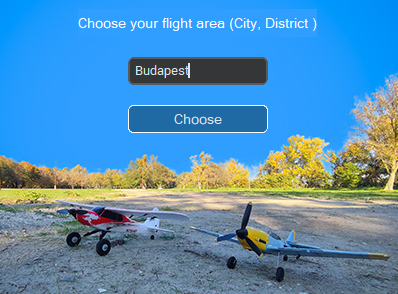
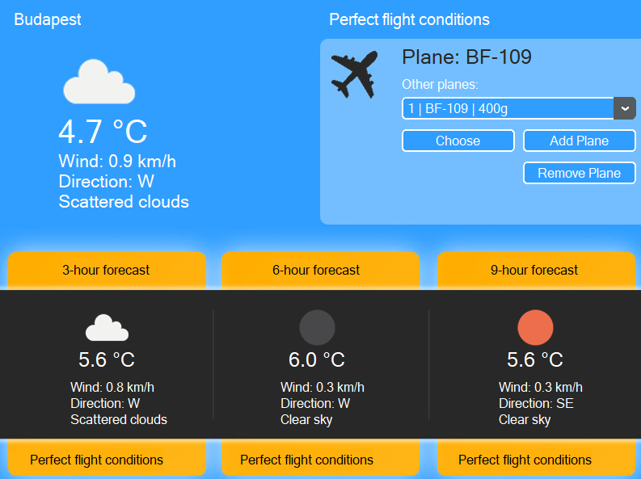

# RcWeather v0.2

# Project Overview:
RcWeather Desktop Application v0.2 is a basic tool designed for radio-controlled airplanes. 

It enables users to manage their RC planes and view essential information about each plane. It retrieves real-time weather data from the OpenWeather free API and evaluates flight conditions based on wind speed and plane weight for the current time and the next 9 hours. 

The GUI uses "ctkinter" to provide a more user-friendly interface than the command line.

 
 

# How to Use
1. Ensure all required libraries are installed (listed in requirements.txt).
2. You should create your own free API key on OpenWeatherMap. Once you have it, make and paste it into .env file which must be in the main folder
    - ex: API_KEY = '12345678901234567890abcdefghijkl'
3. Afterward, run main.py to initialize the application and display the GUI. Enter the location where you want to fly, and you'll see your planes and can add planes to your list.

- To add a plane, click the "Add Plane" button and enter, for example, "Super Cub 500, 75", which indicates the plane name and weight in grams. A confirmation message will appear once the plane is successfully added.

- Then, select the plane from the list to view the relevant weather conditions.

- To remove a plane, click the "Remove Plane" button and enter the plane's ID or NAME (e.g., "1" or "Super Cub 500"). If there is a mistake in the input, the application will do nothing.

# What You See on the GUI
When everything is properly set up, you’ll see the current weather data according to your selected plane, as well as flight conditions above the plane's name. Forecasts for flight conditions and data for the next 3, 6, and 9 hours will also be displayed.

# Source Files
- main.py
- weather_object.py
- planes_object.py
- icons folder
- requirements.txt
- README.md
- UPDATES.md
- models.db (after first start it will be created)
- schema_and_test_data  (sample data for test purposes)
- archive (archived files)

# Main Components:
- GUI section in main.py
- Planes object
- Weather object

### Required Libraries:

- Listed in requirements.txt in the main folder
- The "icons" folder is also required for proper data display on the GUI.

## Weather(self, city) Class
Interacts with OpenWeatherMap’s API to gather real-time weather data based on geolocation. To initialize the class, you need a city input, e.g., "Virginia, Kimberly Hills" or "Budapest, 20. kerület".

## Functions of the Weather Class:
### def get_location_and_api(self, city)
Retrieves the latitude and longitude data for the specified city (accepts city and district inputs), makes an API call to OpenWeatherMap, and sets self.data to the JSON response from the 3.0 API.

### def extract_weather_data(self, weather_entry)
Auxiliary function which returns data for get_weather_current or get_weather_hourly.

### def get_weather_current(self)
- Returns current weather data in the following format: temperature, wind speed, wind direction, cloud cover %, description, icon.
- Example. Tuple within a list:  
    - [("20.1 °C", 2.4, "NE", "32 %", "clear sky", "02d")]

### def get_weather_hourly(self, hours)
- Gets weather forecasts for the next hours.
- Hours parameter values correlate. 
    - def get_weather_hourly(2) - After 2 hours
    - def get_weather_hourly(9) - After 9 hours
- Returns weather data. Tuples within a list:  
    - [('10.5 °C', '1.0', 'NW', '0 %', 'clear sky', '01d'), ('10.2 °C', '1.2', 'NW', '0 %', 'clear sky', '01d'), ('10.0 °C', '1.3', 'NW', '0 %', 'clear sky', '01d')]

### def get_position(self)
- Returns the current location, e.g., "Budapest, 6. kerület".

### def create_json_data(self)
- Creates a json file from current API call

## Planes(self, city) Class
Manages fundamental plane components and actions, such as adding and removing planes, and contains a basic algorithm to evaluate flight conditions. Upon initialization, it reads planes.csv to load saved planes data.

- The city argument is used for evaluating flight conditions.

## Functions of the Plane Class:

### create_db(self)
- Creates models.db if not exits. Checks every startup.

- ("""CREATE TABLE IF NOT EXISTS models ( \
    id INTEGER, \
    plane_name TEXT NOT NULL, \
    plane_weight INTEGER NOT NULL, \
    PRIMARY KEY (id))""") 

### read_db(self)
- Set the self.planes_number
- Reads the database and load into self.planes
- self.planes format will be a tuple within a list
- id,plane_name,plane_weight \
[(1, 'Sport Cub 500', 65), (3, 'BF 109', 400)]

### def add_plane(self, plane_and_weight)
- Adds a plane with weight to the DB, with a maximum of 5 planes. Weight is in grams. 
- Refreshes self.planes
- Input format: "Plane name anything, 325"
- Automatically assigns a new ID

### def remove_plane(self, id_or_name)
- Removes a plane from DB
- Refreshesself.planes
- Parameter can be either the plane’s exact name or ID. Name is case sensitive.
    - ex: "Bf-109"

### def plane_name(self, plane_id)
- Returns the plane name corresponding to the plane's ID.
- ID is the "id" row in DB
- ex: plane_name(7) returns "Super Cub 500".

### def plane_weight(self, plane_id)
- Returns the plane weight corresponding to the plane's ID, 
- ID is the "id" row in DB
- ex: plane_weight(8) returns 75.

### def get_planes_list(self)
- Returns planes list in a proper format. 
- The format is a list
    - ex: ['1 | BF 111 | 450g', '2 | BF 109 | 400g']

### def flight_circumstances(self, plane_id=0, current_or_hourly="current", predict_hours=0)
- Returns flight conditions for the specified plane ID.
- Options:  
    plane_id= plane's id, current_or_hourly="current" or "hourly", predict_hours= n | n = 3 - after 3 hours. Same as "def get_weather_hourly(3)"
- arg "predict_hours" only needed when "current_or_hourly="hourly""

## Main.py
### def main()
Sets the basic appearance mode, color theme, and initializes the GUI.

### def call_gui()
Initializes the full GUI of the app, including pop-ups for location selection, adding, and removing planes.
Each section and box is labeled, such as # Login background, # Wind, and # Temp.
